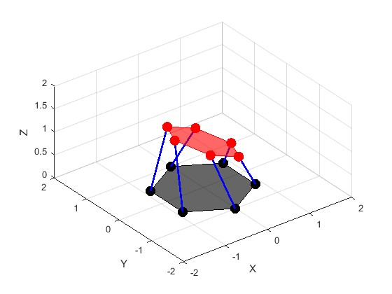

## StewartPlatform

## Note: This README is currently a work in progress and the project is still undergoing development.

This project simulates and animates a **6-DOF Stewart Platform** using MATLAB.  
It demonstrates inverse kinematics, Euler angle interpolation, and visualization of the platform’s motion between two poses.


---

### Features
- Define **start and end positions** (Cartesian coordinates + Euler angles).  
- Compute **inverse kinematics** to determine leg lengths.  
- Animate smooth transitions between poses.  
- 3D visualization of:
  - Base platform (black)  
  - Moving top platform (red)  
  - Connecting legs (blue)  

---

### How It Works
1. **Input Parameters**
   - Start and end positions: `(x, y, z)`  
   - Start and end Euler angles: `(φ = pitch, θ = roll, ψ = yaw)`  
   - Platform geometry defined by 6 base and 6 platform attachment points.

2. **Rotation & Translation**
   - Rotation matrices generated from Euler angles.  
   - Translation applied along the z-axis.  

3. **Inverse Kinematics**
   - Leg lengths calculated as distances between corresponding base and platform joints.

4. **Animation**
   - Euler angles interpolated over `nFrames`.  
   - Platform is updated frame by frame to visualize motion.  

---

### Usage
1. Download the script.  
2. Open in MATLAB.
3. Adjust start and end points and orientations.  
4. Run the script.
5. A 3D animation window will appear showing the Stewart Platform moving between two defined poses.

---

### File Structure
- `generateRotationMatrix.m` → Function for Euler rotations  
- `inverseKinematics.m` → Computes leg lengths given platform pose  

---

### Customization

You can modify the start and end positions (Cartesian coordinates + Euler angles) in the script:  

```matlab
% Enter Cartesian Coordinates
% Start
x1 = 0;
y1 = 0;
z1 = 0;

% End
x2 = 0;
y2 = 0;
z2 = 0;

% Enter Euler Angles
% Start
phi1 = 0;    % pitch, about x
theta1 = 0;  % roll, about y
psi1 = 0;    % yaw, about z

phi1 = deg2rad(phi1);
theta1 = deg2rad(theta1);
psi1 = deg2rad(psi1);

% End
phi2 = -10;   % pitch, about x
theta2 = 20;  % roll, about y
psi2 = -30;   % yaw, about z

phi2 = deg2rad(phi2);
theta2 = deg2rad(theta2);
psi2 = deg2rad(psi2);
